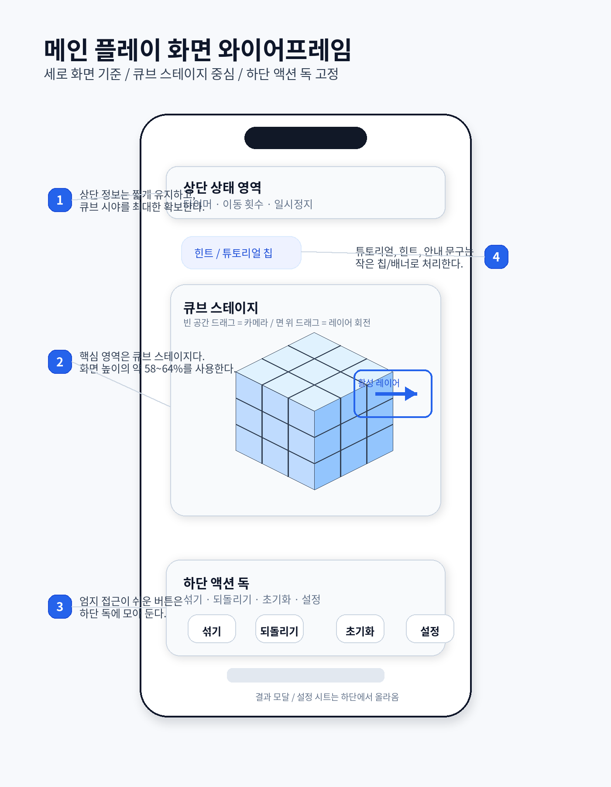
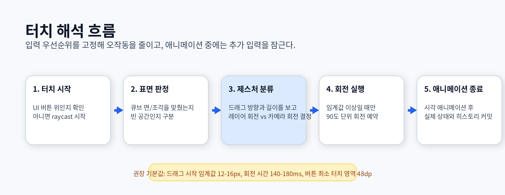
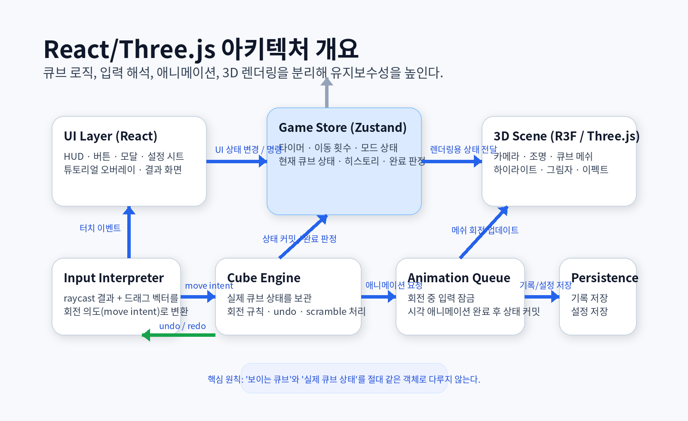

# Mobile-First 3D Cube Game Design

## 화면 설계 · 조작 UX · React/Three.js 프로젝트 구조

> 목표는 **'멋진 3D'보다 '실수 적은 터치 경험'을 먼저 확보하는 것**입니다. 이 문서는 모바일 세로 화면 기준으로 3D 큐브 퍼즐의 화면 구성, 제스처 해석 규칙, 상태 설계, 구현 구조를 한 번에 정리한 설계 문서입니다.

## 프로젝트 한눈에 보기

| 항목 | 내용 |
|---|---|
| 플랫폼 기준 | 모바일 웹 (PWA 확장 가능), 세로 화면 우선 / 손가락 터치 기준 |
| 권장 MVP | 2x2 큐브부터 시작, 섞기 · 되돌리기 · 초기화 · 완료 판정 |
| 조작 모델 | 빈 공간 드래그 = 카메라, 큐브 면 드래그 = 레이어 회전 |
| 권장 스택 | React + TypeScript + @react-three/fiber, Zustand + localStorage |

## 문서 범위

- 메인 플레이 화면, 결과 화면, 설정/일시정지 시트의 배치 원칙
- 터치 해석 규칙, 오작동 방지 장치, 추천 기본 파라미터
- React + Three.js(권장: react-three-fiber) 프로젝트 구조와 책임 분리

---

## 1. 제품 목표와 설계 원칙

모바일 우선 설계에서는 3D 표현력보다 **입력 신뢰도와 시야 확보**가 먼저입니다. 따라서 메인 화면의 모든 결정은 **'한 손으로도 조작 의도가 분명한가'**라는 기준으로 검토해야 합니다.

| 핵심 목표 | 피해야 할 것 | MVP 범위 |
|---|---|---|
| 오작동이 적은 터치<br>세로 화면에서도 큐브가 충분히 크게 보임<br>짧은 학습 비용으로 바로 플레이 가능 | 카메라와 레이어 회전이 자주 충돌함<br>화면 곳곳에 버튼이 흩어져 엄지 이동이 커짐<br>애니메이션 중 연속 입력으로 상태가 꼬임 | 2x2 큐브<br>타이머 · 이동 횟수<br>섞기 / 되돌리기 / 초기화 / 완료 판정 |

### 1.1 핵심 원칙

1. **세로 화면이 기준**  
   기본 레이아웃은 `360x800 ~ 430x932` 범위의 세로 화면에서 가장 자연스럽게 동작해야 합니다.
2. **스테이지가 주인공**  
   큐브 스테이지는 화면 높이의 약 `58~64%`를 사용해 손가락에 가리지 않도록 충분히 크게 잡습니다.
3. **입력 우선순위 고정**  
   `UI -> 큐브 면 -> 빈 공간` 순으로 입력 해석 우선순위를 고정하면 오작동이 급격히 줄어듭니다.
4. **애니메이션 중 입력 잠금**  
   회전 중에는 추가 입력을 받지 않고 큐를 관리해야 상태 동기화가 단순해집니다.
5. **로직과 렌더링 분리**  
   보이는 3D 객체와 실제 큐브 상태를 분리해야 `undo`, `scramble`, 완료 판정이 쉬워집니다.

### 1.2 추천 기본값

| 항목 | 권장값 | 이유 | 비고 |
|---|---|---|---|
| 버튼 최소 터치 영역 | 48dp 이상 | 엄지 입력 안정성 확보 | 주요 버튼은 52~56dp 권장 |
| 드래그 시작 임계값 | 12~16px | 짧은 흔들림을 오입력으로 처리하지 않음 | 기기 DPI에 따라 보정 |
| 1회전 애니메이션 | 140~180ms | 빠르면서도 인지가 쉬움 | 과도하게 느리면 답답함 |
| 큐브 스테이지 높이 | 화면의 58~64% | 시야 확보와 조작 공간의 균형 | 상단/하단 UI와 충돌 방지 |

---

## 2. 화면 설계

메인 화면은 **'보는 곳'과 '누르는 곳'을 명확하게 분리**해야 합니다. 큐브는 중앙에서 충분한 존재감을 가지되, 주요 버튼은 하단 독으로 고정해 한 손 조작을 돕습니다.



*그림 1. 세로 화면 기준 메인 플레이 화면 와이어프레임*

### 2.1 영역별 구성

| 영역 | 역할 | 모바일 설계 포인트 | 우선순위 |
|---|---|---|---|
| 상단 상태 영역 | 타이머 / 이동 횟수 / 일시정지 | 텍스트를 길게 늘리지 않고 한 줄 요약 형태를 유지한다. 알림성 배지는 최대 1개만 사용한다. | 높음 |
| 큐브 스테이지 | 핵심 플레이 공간 | 항상 중앙 정렬. 조작 도중 손가락에 가려져도 현재 면을 이해할 수 있게 충분한 여백을 둔다. | 최상 |
| 힌트/튜토리얼 칩 | 짧은 안내 | 고정 버튼 대신 작고 얇은 칩으로 처리해 메인 공간을 침범하지 않게 한다. | 중간 |
| 하단 액션 독 | 섞기 / 되돌리기 / 초기화 / 설정 | 엄지 영역에 배치하고 버튼 간 간격을 넉넉히 둔다. 핵심 버튼 외 확장은 시트로 숨긴다. | 높음 |
| 결과/설정 시트 | 일시정지 / 기록 / 옵션 | 모달보다 하단 시트가 모바일에서 자연스럽다. 화면을 전부 가리지 않는 반시트 형태가 시작점으로 적절하다. | 중간 |

### 2.2 보조 화면

#### 일시정지 / 설정 시트

- 상단: 계속하기
- 중단: 소리 / 햅틱 / 민감도
- 하단: 나가기 또는 재시작

#### 결과 화면

- 완료 시간
- 이동 횟수
- 다시 플레이
- 기록 보기 또는 공유

튜토리얼은 별도 전면 화면보다 **반투명 오버레이 + 손가락 제스처 애니메이션 2~3장**으로 시작하는 편이 부담이 적습니다.

---

## 3. 조작 UX

모바일에서는 같은 드래그라도 **시작 지점, 이동 거리, 방향**에 따라 의미가 달라집니다. 따라서 입력 우선순위와 임계값을 먼저 정하고, 확신이 낮을 때는 **'아무 동작도 하지 않는' 것**이 더 좋은 UX가 될 수 있습니다.



*그림 2. 입력 우선순위 기반 터치 해석 흐름*

### 3.1 제스처 매핑

| 시작 위치 | 제스처 | 해석 | 피드백 | MVP 권장 |
|---|---|---|---|---|
| UI 버튼 | 탭 | 버튼 액션 우선 처리 | 눌림 상태 + 햅틱 | 사용 |
| 큐브 표면 | 짧은 드래그 | 레이어 회전 후보 | 레이어 하이라이트 | 사용 |
| 빈 공간 | 드래그 | 카메라 회전 | 카메라 미세 이동 | 사용 |
| 전체 화면 | 두 손가락 핀치 | 줌 조절 | 카메라 거리 변화 | 선택 |
| 큐브 표면 | 탭 | 면 선택 또는 도움말 | 미세 강조 | 초기엔 생략 |

### 3.2 터치 해석 규칙

1. UI 버튼 위에서 시작된 터치는 항상 UI가 소비한다.
2. `raycast`가 큐브 면을 맞춘 경우에만 레이어 회전 후보 상태로 들어간다.
3. 드래그 길이가 임계값(`12~16px`)을 넘기기 전까지는 회전을 확정하지 않는다.
4. 드래그 방향을 화면 축이 아니라 **맞춘 면의 로컬 축**으로 변환해 회전 축을 결정한다.
5. 애니메이션 중에는 추가 입력을 잠그고, 완료 후 실제 큐브 상태와 히스토리를 한 번에 커밋한다.

### 3.3 오작동 방지 장치

- 의도가 불분명하면 회전하지 않고 현재 상태를 유지한다.
- 회전 예정 레이어를 얇은 테두리나 밝기 변화로 먼저 강조해 사용자가 무슨 일이 일어날지 미리 볼 수 있게 한다.
- 회전 확정 시 짧은 햅틱을 사용하면 모바일에서 조작 신뢰도가 올라간다.
- 초기 버전에서는 핀치 줌을 끄고 카메라 자동 보정만 제공하는 것도 현실적인 선택이다.

---

## 4. 상태 설계와 게임 로직 모델

게임은 최소한 세 종류의 상태를 분리해 관리하는 것이 좋습니다. 화면 상태(UI), 실제 퍼즐 상태(Game), 3D 표현 상태(Render)가 한 store 안에 뒤섞이면 작은 버그가 바로 입력/애니메이션 꼬임으로 이어집니다.

### 4.1 상태 분리 원칙

| 상태 종류 | 예시 | 책임 |
|---|---|---|
| Game | 큐브 배열, move history, scramble seed | 정답 판정, undo/redo, 저장/복원, 규칙 처리의 기준이 되는 단일 진실원본 |
| Render | 현재 회전 그룹, 메쉬 transform, 하이라이트 | 시각 애니메이션과 프레임 단위 업데이트를 담당. 실제 규칙 계산을 하지 않음 |
| UI | 타이머, 일시정지, 설정, 결과 모달 | 게임 외부 인터페이스와 HUD 상태를 담당 |

### 4.2 추천 상태 머신

| 상태 | 진입 조건 | 허용 동작 |
|---|---|---|
| `idle` | 초기 진입 또는 리셋 직후 | 시작, scramble 준비 |
| `scrambling` | 자동 섞기 실행 | 입력 잠금, 시각 애니메이션만 수행 |
| `interactive` | 플레이 중 | 큐브 입력, 카메라 회전, HUD 업데이트 |
| `animating` | 한 레이어 회전 중 | 추가 입력 잠금, 완료 후 Game 상태 커밋 |
| `paused` | 일시정지 또는 설정 진입 | 큐브 입력 잠금, UI만 상호작용 |
| `solved` | 완료 판정 만족 | 결과 모달, 기록 저장, 재시작 |

완료 판정은 **'모든 면의 스티커 색이 각 면에서 동일한가'**로 판단하면 되고, 2x2 MVP에서는 이 로직이 매우 단순합니다. 3x3으로 확장할 때에도 동일한 상태 모델을 유지할 수 있도록 `move history` 형식을 처음부터 통일해 두는 것이 좋습니다.

---

## 5. React/Three.js 프로젝트 구조

React는 UI와 상태 조합에 강하고, Three.js는 3D 장면 표현에 강합니다. 실무적으로는 **React + `@react-three/fiber` 조합**이 생산성과 유지보수성 측면에서 가장 무난합니다.



*그림 3. 상태, 입력, 3D 렌더링 분리를 기준으로 한 권장 아키텍처*

### 5.1 권장 스택

| 구분 | 권장 선택 | 필수 여부 | 이유 |
|---|---|---|---|
| 번들러 | Vite | 권장 | 빠른 개발 서버와 단순한 구조 |
| 언어 | TypeScript | 권장 | 큐브 상태와 move 타입을 명확하게 관리 |
| 3D 브리지 | `@react-three/fiber` | 권장 | React 방식으로 Three.js 씬을 다루기 쉬움 |
| 헬퍼 | `@react-three/drei` | 선택 | 카메라 / 컨트롤 / 유틸을 빠르게 구성 |
| 상태 | Zustand | 권장 | 작고 빠르며 게임 store 분리에 적합 |
| 저장 | `localStorage` | MVP | 기록, 설정, 마지막 플레이 상태 저장 |
| 테스트 | Vitest + Playwright | 선택 | 규칙 로직과 주요 UX 회귀 테스트에 유용 |

### 5.2 폴더 구조 예시

```text
src/
  app/
    App.tsx
    providers/
  scene/
    CubeScene.tsx
    CameraRig.tsx
    CubieMesh.tsx
  features/game/
    engine/
      cube/        # 큐브 규칙, move 테이블, scramble
      input/       # raycast, gesture, move intent
      animation/   # 회전 큐, 애니메이션 컨트롤
      session/     # timer, result, record
    store/         # zustand store
    ui/            # HUD, 버튼, 모달, 시트
  shared/
    lib/
    ui/
    utils/
    constants/
  assets/
```

### 5.3 모듈 책임 분리

| 모듈 | 대표 파일 | 책임 |
|---|---|---|
| `scene` | `CubeScene.tsx` | 캔버스, 카메라, 조명, 큐브 메쉬 배치. 게임 규칙을 직접 계산하지 않음 |
| `engine/cube` | `moveTable.ts` | 회전 규칙, 큐브 상태 변환, scramble 생성, solved 판정 |
| `engine/input` | `gestureInterpreter.ts` | raycast 결과와 드래그 벡터를 조합해 move intent 또는 camera intent 생성 |
| `engine/animation` | `rotationQueue.ts` | 시각 애니메이션 관리, 회전 중 입력 잠금, 완료 시 커밋 트리거 |
| `store` | `gameStore.ts` | UI/Game 상태의 단일 접근점. 타이머, 이동 횟수, 현재 모드 관리 |
| `ui` | `BottomDock.tsx` | HUD, 버튼, 결과 모달, 설정 시트 구성 |

---

## 6. 구현 순서와 운영 체크리스트

모바일 게임의 품질은 **'처음에 무엇을 빼고, 무엇을 고정하느냐'**에 크게 좌우됩니다. 첫 버전은 기능을 넓히기보다 입력 신뢰도와 프레임 안정성 확보에 집중하는 편이 좋습니다.

### 6.1 단계별 구현 순서

| 단계 | 주요 작업 |
|---|---|
| 1단계 - 기반 구축 | R3F 씬 구성<br>2x2 큐브 메쉬 생성<br>카메라 / 조명 기본값 고정 |
| 2단계 - 입력/회전 | raycast 선택<br>드래그 기반 레이어 회전<br>회전 큐와 입력 잠금 |
| 3단계 - 게임 UX | 섞기, 되돌리기, 초기화<br>타이머, 이동 횟수<br>완료 판정 및 결과 모달 |
| 4단계 - 다듬기 | 햅틱 / 사운드<br>설정 시트<br>기록 저장, 기기별 튜닝 |

### 6.2 체크리스트

- [ ] 중급 안드로이드 기기에서도 플레이 중 `60fps`에 가깝게 유지되는가
- [ ] 회전 중 추가 입력이 실제 상태를 꼬이게 만들지 않는가
- [ ] 손가락이 큐브를 가려도 현재 면과 회전 방향을 인지할 수 있는가
- [ ] 기본 버튼이 한 손 엄지 영역 안에 머무르는가
- [ ] 앱을 다시 열었을 때 기록과 설정이 자연스럽게 복원되는가

---

## 결론

정리하면, 이 프로젝트의 첫 성공 조건은 **'3D가 화려한가'가 아니라 '모바일에서 큐브를 믿고 돌릴 수 있는가'**입니다.
